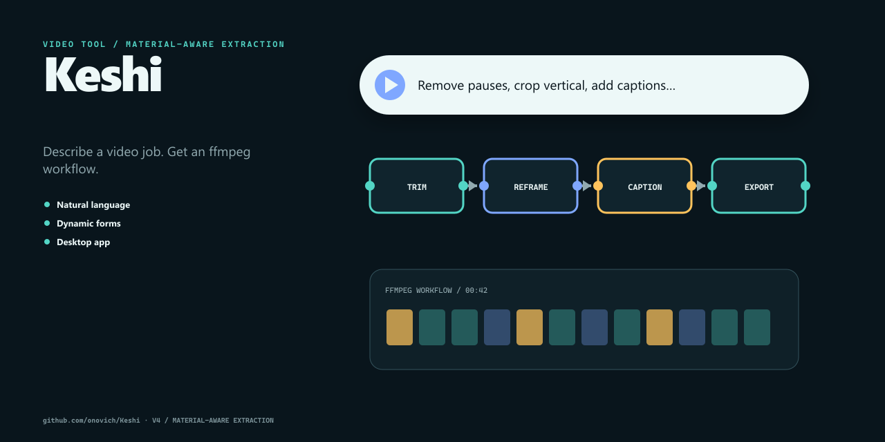

# Keshi

[简体中文](README.zh-CN.md)

Describe a video job. Get an ffmpeg workflow.



## What it includes

- Natural language.
- Dynamic forms.
- Desktop app.

## Getting started

Install dependencies and start the local version:

```bash
npm install
npm run dev
```

The repository also provides `npm run build`、`npm run lint`.

## Repository map

- `src/` — Application and library source.
- `public/` — Static public assets.
- `index.html` — Web entry point.
- `package.json` — Package scripts and dependencies.

## Status

The repository contains the implementation and project material described above. No automated tests are currently present; evaluate it by running the project in the target environment.

## License

No open-source license is currently included in this repository.
